# Diagramas de Arquitetura - Catalog Traffic Engine

Este documento apresenta três níveis de diagramas de arquitetura: alto nível (contexto), médio nível (componentes) e baixo nível (detalhado).

---

## 1. Diagrama de Arquitetura - Alto Nível (Contexto)

Visão do sistema no contexto organizacional, mostrando interações com sistemas externos e stakeholders.

**Legenda:**
- **Azul claro**: Pipeline ETL (Extração, Transformação, Carga)
- **Amarelo claro**: Barramento de Eventos (Kafka)
- **Rosa claro**: Consolidação e Decisão
- **Verde claro**: Integração com Backstage
- **Roxo claro**: Backstage (consumidor)

---

## 2. Diagrama de Arquitetura - Médio Nível (Componentes)

Visão detalhada dos componentes internos e suas interações.

**Legenda:**
- **Linhas sólidas**: Fluxo principal (implementado)
- **Linhas tracejadas**: Fluxo futuro (FinOps)
- **Cores**: Agrupamento por camada funcional

---

## 3. Diagrama de Arquitetura - Baixo Nível (Detalhado)

Visão detalhada das classes, interfaces e dependências internas.

```mermaid
classDiagram
    %% Camada de Descoberta
    class RepositoryCatalog {
        -GitHubClient githubClient
        -RepositoryNameParser nameParser
        +discoverRepositories() Mono~List~RepositoryMetadata~~
    }
    
    class GitHubClient {
        -WebClient webClient
        +listAllRepositories(org) Flux~JsonNode~
        +getRepositoryTopics(org, repo) Mono~List~String~~
    }
    
    class RepositoryNameParser {
        +parse(name) ParsedRepository
        +matchesPattern(name) boolean
    }
    
    %% Camada de Adaptadores
    class DynatraceAdapter {
        -RepositoryCatalog repositoryCatalog
        -DynatraceBatchExtractor batchExtractor
        +extract(TimeWindow) List~RawActivityEvent~
        +extractReactive(TimeWindow) Flux~RawActivityEvent~
    }
    
    class DynatraceBatchExtractor {
        -DynatraceClient dynatraceClient
        +extractBatch(serviceIds, window, repos) Flux~RawActivityEvent~
    }
    
    class DynatraceClient {
        -WebClient webClient
        +getServiceMetrics(serviceId, start, end) Mono~DynatraceServiceMetrics~
        +getServiceCallers(serviceId, start, end) Mono~List~String~~
        +getResourceMetrics(serviceId, start, end) Mono~ResourceMetrics~
        +getServiceEntityDetails(serviceId) Mono~EntityDetails~
    }
    
    %% Camada de Normalização
    class EventNormalizer {
        -ObjectMapper objectMapper
        -EnrichmentService enrichmentService
        +normalize(RawActivityEvent) ServiceActivityEvent
        +normalizeStream(Flux~RawActivityEvent~) Flux~ServiceActivityEvent~
    }
    
    class EnrichmentService {
        +enrich(RawActivityEvent) Metadata
        +calculateConfidence(RawActivityEvent) ConfidenceLevel
    }
    
    class TemporalAggregator {
        +aggregate(Flux~ServiceActivityEvent~) Flux~ServiceActivityEvent~
    }
    
    %% Camada de Kafka
    class KafkaProducer {
        -KafkaTemplate~String, String~ kafkaTemplate
        +publishActivityEvent(ServiceActivityEvent) CompletableFuture
        +publishSnapshot(ServiceActivitySnapshot) CompletableFuture
        +send(topic, key, message) CompletableFuture
    }
    
    class KafkaConsumer {
        -KafkaListener
        +consumeActivityEvent(message, partition, offset)
        +consumeSnapshot(message, partition, offset)
    }
    
    %% Camada de Consolidação
    class ConsolidationCoordinator {
        -KafkaAdminClient adminClient
        +executeConsolidation()
    }
    
    class ConsolidationWorker {
        -KafkaConsumer consumer
        +processPartition(partitionId, windowDays) List~ServiceActivitySnapshot~
    }
    
    class SnapshotGenerator {
        +generateSnapshots(events) List~ServiceActivitySnapshot~
    }
    
    class DecisionEngine {
        -TrafficClassifier classifier
        +generateSnapshot(events) ServiceActivitySnapshot
    }
    
    class TrafficClassifier {
        +classify(lastSeen) Classification
    }
    
    %% Camada de Integração
    class BackstageIntegrationService {
        -BackstageClient backstageClient
        -BackstageMapper mapper
        +consumeSnapshot(message)
    }
    
    class BackstageClient {
        -WebClient webClient
        +updateEntity(serviceId, data) Mono~Void~
    }
    
    %% Camada FinOps
    class FinOpsAnalysisJob {
        -OptimizationRecommender recommender
        -EconomyReportGenerator reportGenerator
        +executeAnalysis()
    }
    
    class OptimizationRecommender {
        -ResourceUtilizationAnalyzer analyzer
        -CostCalculator calculator
        +generateRecommendation(serviceId, start, end) Mono~CostOptimizationRecommendation~
    }
    
    class ResourceUtilizationAnalyzer {
        +analyzeUtilization(serviceId, metrics, details) ServiceFinOpsMetrics
    }
    
    class CostCalculator {
        +calculateCurrentCost(azureCost) BigDecimal
        +calculateOptimizedCost(recommendation, details) BigDecimal
        +calculateSavings(current, optimized, recommendation) CostOptimizationRecommendation
    }
    
    class AzureCostClient {
        -WebClient webClient
        +getResourceCost(resourceId, start, end) Mono~ResourceCost~
        +getResourceDetails(resourceId) Mono~ResourceDetails~
    }
    
    %% Schemas
    class ServiceActivityEvent {
        +String serviceId
        +Long activityCount
        +List~String~ callers
        +TimeWindow window
        +RepositoryInfo repository
        +DiscoverySource discoverySource
    }
    
    class ServiceActivitySnapshot {
        +String serviceId
        +Boolean receivesTraffic
        +Long trafficVolume
        +Instant lastSeen
        +Classification classification
        +ServiceFinOpsMetrics finOpsMetrics
        +CostOptimizationRecommendation costOptimization
    }
    
    %% Relacionamentos
    RepositoryCatalog --> GitHubClient
    RepositoryCatalog --> RepositoryNameParser
    DynatraceAdapter --> RepositoryCatalog
    DynatraceAdapter --> DynatraceBatchExtractor
    DynatraceBatchExtractor --> DynatraceClient
    EventNormalizer --> EnrichmentService
    EventNormalizer --> ServiceActivityEvent
    TemporalAggregator --> ServiceActivityEvent
    KafkaProducer --> ServiceActivityEvent
    KafkaProducer --> ServiceActivitySnapshot
    ConsolidationCoordinator --> ConsolidationWorker
    ConsolidationWorker --> SnapshotGenerator
    SnapshotGenerator --> DecisionEngine
    DecisionEngine --> TrafficClassifier
    DecisionEngine --> ServiceActivitySnapshot
    BackstageIntegrationService --> BackstageClient
    BackstageIntegrationService --> ServiceActivitySnapshot
    FinOpsAnalysisJob --> OptimizationRecommender
    OptimizationRecommender --> ResourceUtilizationAnalyzer
    OptimizationRecommender --> CostCalculator
    OptimizationRecommender --> AzureCostClient
    CostCalculator --> CostOptimizationRecommendation
    ServiceActivitySnapshot --> ServiceFinOpsMetrics
    ServiceActivitySnapshot --> CostOptimizationRecommendation
```

**Legenda:**
- **Classes azuis**: Componentes principais
- **Classes verdes**: Schemas de dados
- **Setas**: Dependências e relacionamentos

---

## 4. Fluxo de Dados Completo

---

## 5. Tecnologias e Dependências

---

## Notas sobre os Diagramas

### Alto Nível (Contexto)
- Foco em **quem** usa o sistema e **quais** sistemas externos interagem
- Mostra o valor de negócio e stakeholders
- Útil para apresentações executivas

### Médio Nível (Componentes)
- Foco em **o quê** o sistema faz (componentes funcionais)
- Mostra fluxo de dados entre camadas
- Útil para arquitetos e desenvolvedores sênior

### Baixo Nível (Detalhado)
- Foco em **como** o sistema funciona (classes e dependências)
- Mostra detalhes de implementação
- Útil para desenvolvedores implementando ou mantendo o código

