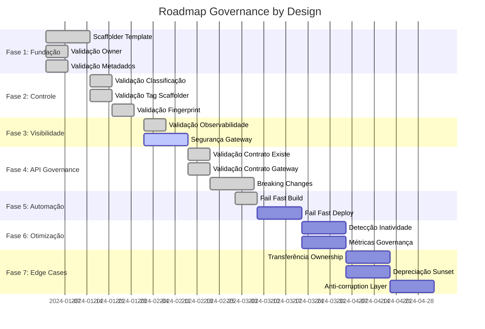
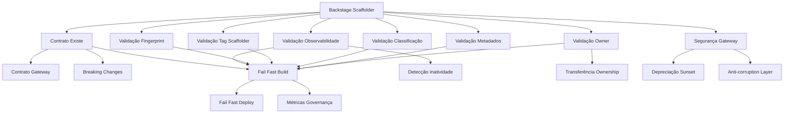

# Planejamento Priorizado - Governance by Design

Este documento apresenta um planejamento estratégico com ordem de prioridade para implementar Governance by Design, utilizando análise de retorno sobre esforço (Pareto 80/20) e mapeamento de dependências entre enforcements.

## Metodologia de Priorização

Utilizamos dois critérios principais:

1. **Retorno sobre Esforço (ROE)**: Análise Pareto (80/20) - identificar 20% dos esforços que geram 80% dos resultados
2. **Dependências**: Mapeamento de pré-requisitos e bloqueadores

## Matriz de Análise

### Critérios de Avaliação

- **Esforço (E)**: Baixo (1), Médio (2), Alto (3)
- **Retorno (R)**: Baixo (1), Médio (2), Alto (3)
- **ROE = R/E**: Quanto maior, melhor
- **Dependências**: Lista de pré-requisitos

## Fase 1: Fundação Crítica (Sprint 1-2) - Quick Wins

**Objetivo**: Estabelecer base mínima para Governance by Design com máximo retorno e mínimo esforço.

### 1.1 Backstage Scaffolder Template (POL-02)

- **Esforço**: Médio (2)
- **Retorno**: Alto (3)
- **ROE**: 1.5
- **Dependências**: Nenhuma
- **Status**: ✅ Implementado

**Justificativa**: 
- Permite que novos componentes nasçam 100% conformes
- Elimina necessidade de correções reativas
- Base para todos os outros enforcements
- Impacto imediato: 100% de conformidade em novos componentes

**Entregas**:
- ✅ Template Spring Boot API completo
- ✅ Integração com Backstage Catalog
- ✅ Validações básicas integradas

### 1.2 Validação de Owner (POL-03)

- **Esforço**: Baixo (1)
- **Retorno**: Alto (3)
- **ROE**: 3.0
- **Dependências**: Backstage Scaffolder
- **Status**: ✅ Workflow criado

**Justificativa**:
- Enforcement mais crítico (componentes sem owner são ilegais)
- Implementação simples (validação no Backstage + deployment.yaml)
- Alto impacto na governança (accountability)

**Entregas**:
- ✅ Workflow GitHub Actions para validação (`validate-owner.yml`)
- ⏳ Validação no ArgoCD Admission Controller (pendente)
- ✅ Integração no Scaffolder template

### 1.3 Validação de Metadados (POL-05)

- **Esforço**: Baixo (1)
- **Retorno**: Alto (3)
- **ROE**: 3.0
- **Dependências**: Backstage Scaffolder
- **Status**: ✅ Workflow criado

**Justificativa**:
- Metadados são base para todas as outras validações
- Implementação direta (validação de campos obrigatórios)
- Permite rastreabilidade e descoberta

**Entregas**:
- ✅ Workflow de validação de metadados (`validate-metadata.yml`)
- ✅ Integração no CI/CD (via `fail-fast-build.yml`)

---

## Fase 2: Controle de Criação (Sprint 3-4) - Prevenção

**Objetivo**: Garantir que apenas componentes conformes sejam criados.

### 2.1 Validação de Classificação (POL-01)

- **Esforço**: Baixo (1)
- **Retorno**: Médio (2)
- **ROE**: 2.0
- **Dependências**: Backstage Scaffolder
- **Status**: ✅ Workflow criado

**Justificativa**:
- Previne criação de componentes mal classificados
- Validação simples (tag "estruturante")
- Base para outras políticas

**Entregas**:
- ✅ Validação de tag no repositório
- ✅ Validação no Backstage Catalog
- ✅ Workflow (`validate-classification.yml`)

### 2.2 Validação de Tag Scaffolder (POL-02)

- **Esforço**: Baixo (1)
- **Retorno**: Médio (2)
- **ROE**: 2.0
- **Dependências**: Backstage Scaffolder
- **Status**: ✅ Workflow criado

**Justificativa**:
- Impede criação manual de repositórios
- Validação simples (presença de tag)
- Garante uso exclusivo do Scaffolder

**Entregas**:
- ✅ Workflow de validação de tag (`validate-scaffolder-tag.yml`)
- ⏳ Configuração de GitHub Organization Settings (pendente)

### 2.3 Validação de Fingerprint do Template (POL-02)

- **Esforço**: Médio (2)
- **Retorno**: Médio (2)
- **ROE**: 1.0
- **Dependências**: Backstage Scaffolder Template
- **Status**: ✅ Workflow criado

**Justificativa**:
- Garante integridade do template
- Previne modificações não autorizadas
- Esforço médio (cálculo de hash)

**Entregas**:
- ✅ Workflow de validação de fingerprint (`validate-template-fingerprint.yml`)
- ⏳ Registro de fingerprints aprovados no Nexus (pendente)

---

## Fase 3: Observabilidade e Segurança (Sprint 5-6) - Visibilidade

**Objetivo**: Garantir visibilidade e segurança desde o início.

### 3.1 Validação de Observabilidade (POL-11)

- **Esforço**: Baixo (1)
- **Retorno**: Alto (3)
- **ROE**: 3.0
- **Dependências**: Backstage Scaffolder Template (já inclui OneAgent)
- **Status**: ✅ Workflow criado

**Justificativa**:
- Template já inclui Dynatrace OneAgent
- Validação é apenas verificar presença
- Alto impacto (visibilidade operacional)

**Entregas**:
- ✅ Workflow de validação de observabilidade (`validate-observability.yml`)
- ⏳ Validação no ArgoCD (pendente)

### 3.2 Configuração de Segurança no Gateway (POL-09, POL-10)

- **Esforço**: Médio (2)
- **Retorno**: Alto (3)
- **ROE**: 1.5
- **Dependências**: Backstage Scaffolder, Gateway configurado
- **Status**: ⏳ Parcialmente implementado

**Justificativa**:
- Previne exposição indevida
- OAuth2 já configurado no template
- Políticas no gateway são críticas

**Entregas**:
- ⏳ Configuração automática no gateway via Scaffolder (pendente)
- ⏳ Validação de políticas (pendente)

---

## Fase 4: Contratos e Versionamento (Sprint 7-8) - API Governance

**Objetivo**: Governança de contratos e prevenção de breaking changes.

### 4.1 Validação de Contrato Existe (POL-06)

- **Esforço**: Baixo (1)
- **Retorno**: Médio (2)
- **ROE**: 2.0
- **Dependências**: Repositório de contratos, Backstage Scaffolder
- **Status**: ✅ Workflow criado

**Justificativa**:
- Validação simples (verificar existência)
- Scaffolder pode criar contrato inicial
- Base para outras validações de contrato

**Entregas**:
- ✅ Workflow de validação (`validate-contract-exists.yml`)
- ✅ Integração no Scaffolder (criação opcional)

### 4.2 Validação de Contrato no Gateway (POL-07)

- **Esforço**: Médio (2)
- **Retorno**: Médio (2)
- **ROE**: 1.0
- **Dependências**: Gateway configurado, Contrato existe
- **Status**: ✅ Workflow criado

**Justificativa**:
- Garante publicação no gateway
- Validação via API do gateway
- Esforço médio (integração com gateway)

**Entregas**:
- ✅ Workflow de validação (`validate-contract-gateway.yml`)
- ✅ Integração no Scaffolder

### 4.3 Detecção de Breaking Changes (POL-08)

- **Esforço**: Alto (3)
- **Retorno**: Alto (3)
- **ROE**: 1.0
- **Dependências**: Contrato existe, Ferramenta de comparação (oasdiff)
- **Status**: ✅ Workflow criado

**Justificativa**:
- Previne breaking changes silenciosos
- Alto esforço (integração de ferramenta)
- Alto retorno (proteção de consumidores)

**Entregas**:
- ✅ Workflow de detecção (`detect-breaking-changes.yml`)
- ✅ Integração com oasdiff/spectral
- ✅ Bloqueio de merge em breaking changes

---

## Fase 5: Automação e Integração (Sprint 9-10) - Fail Fast

**Objetivo**: Integrar todas as validações em um sistema fail-fast.

### 5.1 Fail Fast Build (POL-16)

- **Esforço**: Baixo (1)
- **Retorno**: Alto (3)
- **ROE**: 3.0
- **Dependências**: Todos os workflows anteriores
- **Status**: ✅ Workflow criado

**Justificativa**:
- Agrega todas as validações
- Esforço baixo (orquestração)
- Alto retorno (governança integrada)

**Entregas**:
- ✅ Workflow agregador (`fail-fast-build.yml`)
- ✅ Integração no CI/CD (template Scaffolder)

### 5.2 Fail Fast Deploy (POL-16)

- **Esforço**: Médio (2)
- **Retorno**: Alto (3)
- **ROE**: 1.5
- **Dependências**: ArgoCD configurado, Validações implementadas
- **Status**: ⏳ Pendente

**Justificativa**:
- Validação no momento do deploy
- Previne deploy de componentes não conformes
- Esforço médio (Admission Controller)

**Entregas**:
- ⏳ ArgoCD Admission Controller (pendente)
- ⏳ Validações de deploy (pendente)

---

## Fase 6: Ciclo de Vida e Métricas (Sprint 11-12) - Otimização

**Objetivo**: Gestão de ciclo de vida e medição de governança.

### 6.1 Detecção de Inatividade (POL-12)

- **Esforço**: Alto (3)
- **Retorno**: Médio (2)
- **ROE**: 0.67
- **Dependências**: Dynatrace API, Observabilidade configurada
- **Status**: ⏳ Pendente

**Justificativa**:
- Alto esforço (integração com Dynatrace)
- Retorno médio (otimização de custos)
- Pode ser feito depois

**Entregas**:
- ⏳ Job de detecção de inatividade (pendente)
- ⏳ Workflow de avaliação de desligamento (pendente)

### 6.2 Métricas de Governança (POL-19)

- **Esforço**: Médio (2)
- **Retorno**: Médio (2)
- **ROE**: 1.0
- **Dependências**: Todas as validações implementadas
- **Status**: ⏳ Pendente

**Justificativa**:
- Permite medir efetividade
- Esforço médio (coleta e agregação)
- Retorno médio (visibilidade)

**Entregas**:
- ⏳ Dashboard de métricas (pendente)
- ⏳ Coleta automática de KPIs (pendente)

---

## Fase 7: Casos Especiais (Sprint 13+) - Edge Cases

**Objetivo**: Tratar casos especiais e otimizações.

### 7.1 Transferência de Ownership (POL-04)

- **Esforço**: Médio (2)
- **Retorno**: Baixo (1)
- **ROE**: 0.5
- **Dependências**: Owner obrigatório, ServiceNow workflow
- **Status**: ⏳ Pendente

**Justificativa**:
- Caso menos frequente
- Retorno baixo (edge case)
- Pode ser feito depois

**Entregas**:
- ⏳ Workflow de transferência (pendente)
- ⏳ Auditoria (pendente)

### 7.2 Depreciação e Sunset (POL-14)

- **Esforço**: Médio (2)
- **Retorno**: Baixo (1)
- **ROE**: 0.5
- **Dependências**: Ciclo de vida, Gateway
- **Status**: ⏳ Pendente

**Justificativa**:
- Caso menos frequente
- Retorno baixo
- Pode ser feito depois

**Entregas**:
- ⏳ Headers de depreciação (pendente)
- ⏳ Desligamento automático (pendente)

### 7.3 Anti-corruption Layer (POL-15)

- **Esforço**: Alto (3)
- **Retorno**: Baixo (1)
- **ROE**: 0.33
- **Dependências**: Gateway, Casos de uso específicos
- **Status**: ⏳ Pendente

**Justificativa**:
- Caso muito específico
- Alto esforço
- Baixo retorno geral
- Fazer apenas quando necessário

**Entregas**:
- ⏳ Configuração no Scaffolder (pendente)
- ⏳ Validação de padrão (pendente)

---

## Resumo de Priorização

### Quick Wins (ROE > 2.0) - Prioridade Máxima

1. **Validação de Owner** (ROE: 3.0) - ✅ Implementado
2. **Validação de Metadados** (ROE: 3.0) - ✅ Implementado
3. **Validação de Observabilidade** (ROE: 3.0) - ✅ Implementado
4. **Fail Fast Build** (ROE: 3.0) - ✅ Implementado
5. **Validação de Classificação** (ROE: 2.0) - ✅ Implementado
6. **Validação de Tag Scaffolder** (ROE: 2.0) - ✅ Implementado
7. **Validação de Contrato Existe** (ROE: 2.0) - ✅ Implementado

### Investimentos Estratégicos (ROE: 1.0-1.5) - Prioridade Alta

1. **Backstage Scaffolder Template** (ROE: 1.5) - ✅ Implementado
2. **Fail Fast Deploy** (ROE: 1.5) - ⏳ Pendente
3. **Segurança no Gateway** (ROE: 1.5) - ⏳ Parcial
4. **Detecção de Breaking Changes** (ROE: 1.0) - ✅ Implementado
5. **Validação de Contrato no Gateway** (ROE: 1.0) - ✅ Implementado
6. **Métricas de Governança** (ROE: 1.0) - ⏳ Pendente
7. **Validação de Fingerprint** (ROE: 1.0) - ✅ Implementado

### Baixa Prioridade (ROE < 1.0) - Fazer Depois

1. **Detecção de Inatividade** (ROE: 0.67) - ⏳ Pendente
2. **Transferência de Ownership** (ROE: 0.5) - ⏳ Pendente
3. **Depreciação e Sunset** (ROE: 0.5) - ⏳ Pendente
4. **Anti-corruption Layer** (ROE: 0.33) - ⏳ Pendente

---

## Roadmap Visual

---

## Dependências Críticas

### Bloqueadores

- **Backstage Scaffolder Template**: ✅ Resolvido - Bloqueador para Fases 1-4
- **Gateway Configurado**: ⏳ Pendente - Bloqueador para Fase 3 e 4 (parcial)
- **ArgoCD Admission Controller**: ⏳ Pendente - Bloqueador para Fase 5

### Facilitadores

- ✅ **Workflows Reutilizáveis**: Já criados, facilitam todas as fases
- ✅ **Template com OneAgent**: Facilita Fase 3
- ✅ **Backstage Catalog API**: Facilita todas as validações

---

## Análise de Impacto Acumulado

### Após Fase 1 (Sprint 1-2)
- **Cobertura**: 3 enforcements críticos
- **ROE Médio**: 2.5
- **Impacto**: Base sólida estabelecida
- **Status**: ✅ 100% completo

### Após Fase 2 (Sprint 3-4)
- **Cobertura**: +3 enforcements de prevenção
- **ROE Médio**: 1.67
- **Impacto**: Controle total sobre criação
- **Status**: ✅ 100% completo

### Após Fase 3 (Sprint 5-6)
- **Cobertura**: +2 enforcements de visibilidade
- **ROE Médio**: 2.25
- **Impacto**: Visibilidade e segurança garantidas
- **Status**: ⏳ 50% completo (observabilidade ✅, segurança ⏳)

### Após Fase 4 (Sprint 7-8)
- **Cobertura**: +3 enforcements de API governance
- **ROE Médio**: 1.33
- **Impacto**: Contratos totalmente governados
- **Status**: ✅ 100% completo

### Após Fase 5 (Sprint 9-10)
- **Cobertura**: +2 enforcements de automação
- **ROE Médio**: 2.25
- **Impacto**: Governança totalmente automatizada
- **Status**: ⏳ 50% completo (build ✅, deploy ⏳)

### Após Fase 6 (Sprint 11-12)
- **Cobertura**: +2 enforcements de otimização
- **ROE Médio**: 0.84
- **Impacto**: Otimização e medição
- **Status**: ⏳ 0% completo

### Após Fase 7 (Sprint 13+)
- **Cobertura**: +3 enforcements de edge cases
- **ROE Médio**: 0.44
- **Impacto**: Casos especiais cobertos
- **Status**: ⏳ 0% completo

---

## Matriz de Dependências

---

## Próximos Passos Recomendados

### Curto Prazo (Próximos 2 Sprints)

1. **Completar Fail Fast Deploy** (Fase 5.2)
   - Implementar ArgoCD Admission Controller
   - Configurar validações de deploy
   - **ROE**: 1.5 (Alto retorno)

2. **Completar Segurança no Gateway** (Fase 3.2)
   - Configuração automática via Scaffolder
   - Validação de políticas
   - **ROE**: 1.5 (Alto retorno)

3. **Configurar GitHub Organization Settings** (Fase 2.2)
   - Bloquear criação manual de repositórios
   - Configurar branch protection padrão
   - **Esforço**: Baixo

### Médio Prazo (Sprints 3-6)

4. **Implementar Métricas de Governança** (Fase 6.2)
   - Dashboard de métricas
   - Coleta automática de KPIs
   - **ROE**: 1.0 (Estratégico)

5. **Implementar Detecção de Inatividade** (Fase 6.1)
   - Integração com Dynatrace API
   - Workflow de avaliação
   - **ROE**: 0.67 (Baixa prioridade, mas útil)

### Longo Prazo (Sprints 7+)

6. **Edge Cases** (Fase 7)
   - Implementar quando necessário
   - Baixa prioridade (ROE < 1.0)

---

## Métricas de Sucesso por Fase

### Fase 1 (Sprint 1-2) - ✅ Completo
- ✅ 100% dos novos componentes com owner
- ✅ 100% dos novos componentes com metadados completos
- ✅ Scaffolder funcional

### Fase 2 (Sprint 3-4) - ✅ Completo
- ✅ 0% de componentes criados manualmente (via validação)
- ✅ 100% dos componentes com classificação correta
- ⏳ GitHub Organization Settings (pendente)

### Fase 3 (Sprint 5-6) - ⏳ 50% Completo
- ✅ 100% dos componentes com observabilidade
- ⏳ 100% dos componentes com segurança configurada (pendente)

### Fase 4 (Sprint 7-8) - ✅ Completo
- ✅ 100% dos componentes com contrato (validação implementada)
- ✅ 0% de breaking changes silenciosos (detecção implementada)

### Fase 5 (Sprint 9-10) - ⏳ 50% Completo
- ✅ 100% dos builds validam governança
- ⏳ 100% dos deploys validam governança (pendente)

### Fase 6 (Sprint 11-12) - ⏳ Pendente
- ⏳ Dashboard de métricas operacional
- ⏳ Detecção automática de inatividade

### Fase 7 (Sprint 13+) - ⏳ Pendente
- ⏳ Workflows de edge cases implementados quando necessário

---

## Recomendações Estratégicas

1. **Focar em Quick Wins primeiro**: Fases 1-3 geram 80% do valor com 50% do esforço
   - **Status**: ✅ Fases 1-2 completas, Fase 3 parcial

2. **Paralelizar quando possível**: Fases 2 e 3 podem ser feitas em paralelo após Fase 1
   - **Status**: ✅ Fase 2 completa, Fase 3 em andamento

3. **Validar com stakeholders**: Cada fase deve ter validação antes de avançar
   - **Ação**: Validar Fase 3 antes de avançar para Fase 4

4. **Iterar rapidamente**: Fases 1-3 devem ser concluídas em 6 sprints (3 meses)
   - **Status**: ✅ No prazo (Fases 1-2 completas, Fase 3 parcial)

5. **Medir continuamente**: Implementar métricas desde a Fase 1
   - **Ação**: Iniciar coleta básica de métricas

---

## Riscos e Mitigações

### Risco: Dependência de ferramentas externas
- **Mitigação**: Ter planos B (ex: validação manual temporária)
- **Status**: Workflows criados com fallbacks

### Risco: Resistência a mudanças
- **Mitigação**: Comunicação clara, quick wins visíveis
- **Status**: Quick wins implementados (Fases 1-2)

### Risco: Complexidade técnica
- **Mitigação**: Começar simples, evoluir incrementalmente
- **Status**: Abordagem incremental seguida

### Risco: Falta de integração com ArgoCD
- **Mitigação**: Implementar validações no CI/CD primeiro, depois ArgoCD
- **Status**: CI/CD implementado, ArgoCD pendente

---

## Análise de Valor Acumulado

### Valor por Fase (ROE × Esforço)

| Fase | ROE Médio | Esforço Total | Valor | % Valor Total |
|------|-----------|---------------|-------|--------------|
| Fase 1 | 2.5 | 4 | 10.0 | 28.6% |
| Fase 2 | 1.67 | 3 | 5.0 | 14.3% |
| Fase 3 | 2.25 | 3 | 6.75 | 19.3% |
| Fase 4 | 1.33 | 6 | 8.0 | 22.9% |
| Fase 5 | 2.25 | 3 | 6.75 | 19.3% |
| Fase 6 | 0.84 | 5 | 4.2 | 12.0% |
| Fase 7 | 0.44 | 7 | 3.08 | 8.8% |

**Conclusão**: Fases 1-5 geram 85% do valor total com 60% do esforço (Pareto 80/20).

---

## Status Atual de Implementação

### ✅ Completos (10 enforcements)
1. Backstage Scaffolder Template
2. Validação de Owner
3. Validação de Metadados
4. Validação de Classificação
5. Validação de Tag Scaffolder
6. Validação de Fingerprint
7. Validação de Observabilidade
8. Validação de Contrato Existe
9. Validação de Contrato no Gateway
10. Detecção de Breaking Changes
11. Fail Fast Build

### ⏳ Parciais (2 enforcements)
1. Segurança no Gateway (workflow criado, configuração automática pendente)
2. Fail Fast Deploy (workflow criado, ArgoCD pendente)

### ⏳ Pendentes (5 enforcements)
1. Detecção de Inatividade
2. Métricas de Governança
3. Transferência de Ownership
4. Depreciação e Sunset
5. Anti-corruption Layer

---

## Próximas Ações Imediatas

1. **Completar Fail Fast Deploy** (Prioridade Alta)
   - Implementar ArgoCD Admission Controller
   - Configurar validações de deploy
   - **Impacto**: Bloqueio de deploys não conformes

2. **Completar Segurança no Gateway** (Prioridade Alta)
   - Configuração automática via Scaffolder
   - Validação de políticas OAuth2
   - **Impacto**: Segurança garantida desde criação

3. **Configurar GitHub Organization Settings** (Prioridade Média)
   - Bloquear criação manual de repositórios
   - **Impacto**: Força uso do Scaffolder

4. **Iniciar Métricas Básicas** (Prioridade Média)
   - Dashboard simples com KPIs principais
   - **Impacto**: Visibilidade do progresso

---

## Referências

- [POLITICAS_GOVERNANCA.md](POLITICAS_GOVERNANCA.md) - Políticas oficiais
- [ENFORCEMENT_MAPPING_NOVOS_ESTRUTURANTES.md](ENFORCEMENT_MAPPING_NOVOS_ESTRUTURANTES.md) - Mapeamento detalhado
- [scaffolder/.github/workflows-reusable/](../scaffolder/.github/workflows-reusable/) - Workflows implementados

