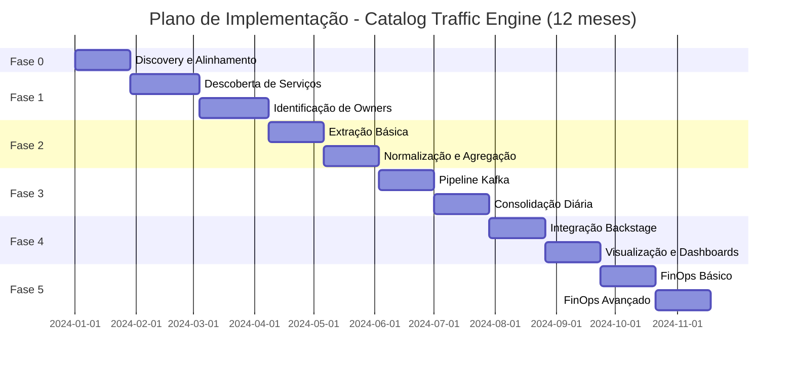

# Plano de Implementação - Catalog Traffic Engine

Este documento apresenta um plano detalhado de implementação em fases, priorizando a identificação de serviços e owners, deixando FinOps para a última fase.

---

## Visão Geral das Fases

---

## Fase 0: Discovery e Alinhamento (Fundação)

**Objetivo**: Alinhar com equipe, gestão, stakeholders e áreas responsáveis pelas integrações para obter detalhamento técnico necessário.

**Duração Estimada**: 4 semanas (1 mês)

### 0.1 Alinhamento com Stakeholders (1 semana)

**Entregas:**
- [ ] **Apresentação do projeto para gestão e stakeholders**
- [ ] **Documentação de objetivos e benefícios esperados**
- [ ] **Definição de KPIs e métricas de sucesso**
- [ ] **Aprovação formal do projeto**
- [ ] **Definição de equipe e responsabilidades**

**Critérios de Aceite:**
- Projeto aprovado formalmente pela gestão
- Stakeholders alinhados com objetivos
- KPIs definidos e acordados
- Equipe designada e disponível

**Tarefas:**
1. Preparar apresentação executiva do projeto
2. Agendar reuniões com gestão e stakeholders
3. Documentar objetivos, escopo e benefícios
4. Definir KPIs e métricas de sucesso
5. Obter aprovação formal do projeto
6. Designar equipe e definir responsabilidades

### 0.2 Alinhamento Técnico - GitHub (1 semana)

**Entregas:**
- [ ] **Reunião com equipe responsável pelo GitHub**
- [ ] **Documentação de APIs disponíveis e rate limits**
- [ ] **Definição de estratégia de autenticação (token, OAuth, etc)**
- [ ] **Mapeamento de ambientes (dev, hom, prod)**
- [ ] **Definição de custos e licenças**
- [ ] **Documentação de limitações e restrições**

**Critérios de Aceite:**
- APIs identificadas e documentadas
- Rate limits conhecidos e considerados
- Estratégia de autenticação definida
- Ambientes mapeados e acessos solicitados
- Custos estimados e aprovados

**Tarefas:**
1. Agendar reunião com equipe do GitHub
2. Identificar APIs necessárias:
   - GitHub REST API v3
   - GitHub GraphQL API v4
   - GitHub Search API
3. Documentar rate limits:
   - Rate limit por token
   - Rate limit por IP
   - Rate limit para diferentes endpoints
4. Definir estratégia de autenticação:
   - Personal Access Token (PAT)
   - GitHub App
   - OAuth App
5. Mapear ambientes:
   - GitHub Enterprise Server (se aplicável)
   - GitHub.com (cloud)
   - Ambientes de dev, hom, prod
6. Solicitar acessos necessários
7. Identificar custos:
   - Licenças GitHub Enterprise (se aplicável)
   - Custos de API calls (se houver)
8. Documentar limitações:
   - Limites de paginação
   - Limites de queries GraphQL
   - Limites de webhooks

### 0.3 Alinhamento Técnico - Dynatrace (1 semana)

**Entregas:**
- [ ] **Reunião com equipe responsável pelo Dynatrace**
- [ ] **Documentação de APIs disponíveis (REST, Metrics, Events)**
- [ ] **Definição de estratégia de autenticação (token, OAuth)**
- [ ] **Mapeamento de ambientes (dev, hom, prod)**
- [ ] **Definição de custos e licenças**
- [ ] **Documentação de limitações (rate limits, quotas)**
- [ ] **Definição de métricas a serem coletadas**

**Critérios de Aceite:**
- APIs identificadas e documentadas
- Rate limits conhecidos e considerados
- Estratégia de autenticação definida
- Ambientes mapeados e acessos solicitados
- Custos estimados e aprovados
- Métricas definidas e disponíveis

**Tarefas:**
1. Agendar reunião com equipe do Dynatrace
2. Identificar APIs necessárias:
   - Dynatrace REST API v2
   - Metrics API
   - Events API
   - Entity API
3. Documentar rate limits:
   - Rate limit por token
   - Rate limit por endpoint
   - Quotas de métricas
4. Definir estratégia de autenticação:
   - API Token
   - OAuth 2.0
5. Mapear ambientes:
   - Dynatrace Managed
   - Dynatrace SaaS
   - Ambientes de dev, hom, prod
6. Solicitar acessos necessários
7. Identificar custos:
   - Licenças Dynatrace
   - Custos de API calls (se houver)
   - Custos de métricas customizadas
8. Documentar limitações:
   - Limites de queries
   - Limites de métricas
   - Limites de eventos
9. Definir métricas a serem coletadas:
   - Service metrics (CPU, memory, request rate)
   - Service callers
   - Resource utilization (para FinOps)

### 0.4 Alinhamento Técnico - Backstage (1 semana)

**Entregas:**
- [ ] **Reunião com equipe responsável pelo Backstage**
- [ ] **Documentação de APIs disponíveis (Catalog API, etc)**
- [ ] **Definição de estratégia de autenticação**
- [ ] **Mapeamento de ambientes (dev, hom, prod)**
- [ ] **Definição de schema de entidades e campos customizados**
- [ ] **Documentação de limitações e restrições**
- [ ] **Definição de processo de aprovação para mudanças**

**Critérios de Aceite:**
- APIs identificadas e documentadas
- Estratégia de autenticação definida
- Ambientes mapeados e acessos solicitados
- Schema de entidades definido
- Processo de aprovação documentado

**Tarefas:**
1. Agendar reunião com equipe do Backstage
2. Identificar APIs necessárias:
   - Catalog API
   - Entity API
   - Location API
3. Definir estratégia de autenticação:
   - API Token
   - OAuth
   - Service Account
4. Mapear ambientes:
   - Backstage instances (dev, hom, prod)
   - URLs e endpoints
5. Solicitar acessos necessários
6. Definir schema de entidades:
   - Campos customizados necessários
   - Annotations customizadas
   - Metadata fields
7. Documentar limitações:
   - Rate limits
   - Limites de tamanho de payload
   - Limites de atualizações
8. Definir processo de aprovação:
   - Mudanças em schema
   - Criação de campos customizados
   - Acesso a APIs

### 0.5 Alinhamento Técnico - Azure (1 semana - paralelo com Backstage)

**Entregas:**
- [ ] **Reunião com equipe responsável pelo Azure**
- [ ] **Documentação de Azure Cost Management API**
- [ ] **Definição de estratégia de autenticação (Service Principal, Managed Identity)**
- [ ] **Mapeamento de subscriptions e resource groups**
- [ ] **Definição de custos e licenças**
- [ ] **Documentação de limitações e quotas**
- [ ] **Definição de mapeamento serviceId → Azure ResourceId**

**Critérios de Aceite:**
- APIs identificadas e documentadas
- Estratégia de autenticação definida
- Subscriptions mapeadas e acessos solicitados
- Custos estimados e aprovados
- Estratégia de mapeamento definida

**Tarefas:**
1. Agendar reunião com equipe do Azure
2. Identificar APIs necessárias:
   - Azure Cost Management API
   - Azure Resource Graph API
   - Azure Monitor API
3. Definir estratégia de autenticação:
   - Service Principal
   - Managed Identity
   - Azure AD App Registration
4. Mapear subscriptions:
   - Identificar subscriptions relevantes
   - Mapear resource groups
   - Identificar recursos (App Services, Container Instances, etc)
5. Solicitar acessos necessários:
   - Reader role para Cost Management
   - Reader role para Resource Graph
6. Identificar custos:
   - Custos de API calls (se houver)
   - Custos de queries (se houver)
7. Documentar limitações:
   - Rate limits
   - Quotas de queries
   - Limites de dados históricos
8. Definir estratégia de mapeamento:
   - Via tags do Dynatrace (azure.resourceId)
   - Via configuração manual
   - Via Resource Graph queries

### 0.6 Documentação e Planejamento Final (1 semana)

**Entregas:**
- [ ] **Documento consolidado de descobertas técnicas**
- [ ] **Plano de implementação revisado com base nas descobertas**
- [ ] **Definição de ambiente de desenvolvimento**
- [ ] **Cronograma detalhado revisado**
- [ ] **Identificação de riscos e dependências**
- [ ] **Plano de mitigação de riscos**

**Critérios de Aceite:**
- Documentação completa e aprovada
- Plano revisado e validado
- Ambiente de desenvolvimento definido
- Cronograma realista e aprovado
- Riscos identificados e mitigados

**Tarefas:**
1. Consolidar todas as descobertas técnicas em documento único
2. Revisar plano de implementação com base nas descobertas:
   - Ajustar estimativas de tempo
   - Identificar dependências
   - Ajustar estratégias técnicas
3. Definir ambiente de desenvolvimento:
   - Infraestrutura necessária
   - Ferramentas e tecnologias
   - Acessos e permissões
4. Criar cronograma detalhado:
   - Sprints/iterações
   - Marcos (milestones)
   - Dependências entre tarefas
5. Identificar riscos:
   - Riscos técnicos
   - Riscos de negócio
   - Riscos de integração
6. Criar plano de mitigação:
   - Ações preventivas
   - Planos de contingência
   - Responsáveis por mitigação

**Riscos e Mitigações:**
- **Risco**: Acesso a APIs pode demorar para ser aprovado
  - **Mitigação**: Solicitar acessos com antecedência, ter planos alternativos
- **Risco**: Rate limits podem ser mais restritivos que esperado
  - **Mitigação**: Ajustar estratégia de cache e processamento em batch
- **Risco**: Custos podem ser maiores que o orçamento
  - **Mitigação**: Negociar com áreas responsáveis, buscar alternativas
- **Risco**: APIs podem não ter todas as funcionalidades necessárias
  - **Mitigação**: Identificar workarounds, ajustar requisitos se necessário

---

## Fase 1: Descoberta e Identificação (Fundação)

**Objetivo**: Identificar todos os serviços da organização e seus owners.

**Duração Estimada**: 10 semanas (2.5 meses)

**Nota**: Duração aumentada para considerar burocracia organizacional e complexidade de integrações em ambiente grande.

### 1.1 Descoberta de Serviços via Git (5 semanas)

**Entregas:**
- [x] GitHubAdapter implementado
- [x] RepositoryCatalog implementado
- [x] RepositoryNameParser implementado
- [x] CatalogYamlGenerator implementado
- [x] CatalogYamlPRService implementado
- [x] CatalogYamlCreationJob implementado
- [ ] **Testes de integração com GitHub API**
- [ ] **Validação de parsing de nomes (2k+ repositórios)**
- [ ] **Cache funcionando corretamente**
- [ ] **Tratamento de rate limiting da GitHub API**
- [ ] **Criação de PRs com catalog-info.yaml (80%+ aprovação)**
- [ ] **Métricas de descoberta (total repos, repos filtrados)**

**Critérios de Aceite:**
- Sistema descobre 100% dos repositórios que seguem o padrão `{sigla}-{tipo}-{nome}`
- Cache reduz chamadas à API em >80%
- Rate limiting respeitado (sem erros 429)
- Tempo de descoberta < 5 minutos para 2k repositórios

**Tarefas Técnicas:**
1. Implementar testes unitários para `RepositoryNameParser`
2. Implementar testes de integração mockando GitHub API
3. Configurar cache com TTL adequado
4. Implementar retry com backoff exponencial
5. Executar `CatalogYamlCreationJob` para criar PRs iniciais
6. Monitorar aprovação/merge dos PRs de catalog-info.yaml
7. Adicionar métricas Prometheus:
   - `governance_discovery_repositories_total`
   - `governance_discovery_repositories_filtered_total`
   - `governance_discovery_duration_seconds`
   - `governance_catalog_yaml_prs_created_total`
   - `governance_catalog_yaml_prs_merged_total`
   - `governance_catalog_yaml_prs_rejected_total`

**Riscos e Mitigações:**
- **Risco**: GitHub API pode ter rate limits restritivos
  - **Mitigação**: Implementar cache agressivo e processamento em batch
- **Risco**: Repositórios podem não seguir padrão de nomenclatura
  - **Mitigação**: Criar relatório de repositórios não mapeados

### 1.2 Identificação de Owners (4 semanas)

**Entregas:**
- [x] OwnerInferenceEngine implementado
- [x] CommitHistoryStrategy implementado
- [x] DependencyAnalysisStrategy implementado (habilitar após Fase 2)
- [x] RepositoryMetadata estendido com campos de ownership
- [x] Integração com RepositoryCatalog para enriquecimento automático
- [x] BackstagePhase1Service implementado
- [ ] **Testes de inferência de ownership**
- [ ] **Validação de confiança das inferências**
- [ ] **60%+ dos serviços com owner inferido (confiança >= 60%)**
- [ ] **Atualização do Backstage via API com dados de ownership (Fase 1)**
- [ ] **Habilitar DependencyAnalysisStrategy após Fase 2**

**Critérios de Aceite:**
- 60%+ dos serviços têm owner identificado automaticamente (confiança >= 60%)
- Confiança média das inferências > 65%
- Dados de ownership visíveis no Backstage
- Sistema de fallback funciona para serviços sem owner

**Estratégias Implementadas:**

1. **Commit History (Alta Confiança - 75-85%)**
   - Analisa últimos 6-12 meses de commits
   - Identifica top committers com peso maior para commits recentes
   - Ignora bots automaticamente
   - Configurável via `ownership.inference.commit-history.*`

2. **Dependency Analysis (Baixa-Média Confiança - 50-65%)**
   - Analisa callers do serviço (disponível após Fase 2)
   - Agrupa callers por sigla
   - Infere ownership se >70% dos callers são da mesma sigla
   - Requer mapeamento sigla → owner

**Tarefas Técnicas:**
1. Executar inferência de ownership para todos os repositórios
2. Validar inferências manualmente (amostra)
3. Ajustar thresholds de confiança se necessário
4. Atualizar Backstage via API com dados de ownership (Fase 1)
5. Monitorar métricas de inferência
6. Habilitar DependencyAnalysisStrategy após Fase 2
7. Adicionar métricas:
   - `governance_ownership_inference_attempts_total{strategy}`
   - `governance_ownership_inference_success_total{strategy}`
   - `governance_ownership_inference_confidence_avg{strategy}`
   - `governance_ownership_inferred_total{confidence_level}`
   - `governance_ownership_unknown_total`

**Riscos e Mitigações:**
- **Risco**: Inferência de ownership pode estar incorreta
  - **Mitigação**: Mostrar confiança, permitir correção manual, validar amostra
- **Risco**: Commit history pode não estar disponível para todos os repos
  - **Mitigação**: Tratamento de erros, fallback para unknown
- **Risco**: Dependency Analysis requer dados de atividade
  - **Mitigação**: Implementar apenas após Fase 2, usar como estratégia secundária

### 1.3 Validação e Gaps (1 semana)

**Entregas:**
- [ ] **Relatório de serviços descobertos vs. esperados**
- [ ] **Relatório de serviços sem owner**
- [ ] **Dashboard de cobertura de descoberta**
- [ ] **Processo de onboarding para preencher gaps**

**Critérios de Aceite:**
- Relatórios gerados automaticamente
- Dashboard mostra cobertura >90%
- Processo de onboarding documentado

---

## Fase 2: Extração e Normalização (Dados)

**Objetivo**: Extrair métricas de atividade e normalizar para schema canônico.

**Duração Estimada**: 8 semanas (2 meses)

**Nota**: Duração aumentada para considerar burocracia organizacional, testes extensivos e validações em ambiente grande.

### 2.1 Extração Básica de Dynatrace (4 semanas)

**Entregas:**
- [x] DynatraceAdapter implementado
- [x] DynatraceClient implementado
- [x] DynatraceBatchExtractor implementado
- [ ] **Testes de integração com Dynatrace API (mock)**
- [ ] **Validação de escalabilidade (2k serviços)**
- [ ] **Circuit breakers e retry funcionando**
- [ ] **Métricas de extração (taxa, latência, erros)**

**Critérios de Aceite:**
- Extração completa de 2k serviços em < 10 minutos
- Taxa de erro < 1%
- Circuit breakers protegem contra falhas da API
- Métricas disponíveis em Prometheus

**Tarefas Técnicas:**
1. Implementar testes de integração mockando Dynatrace API
2. Testes de carga com 2k serviços simulados
3. Configurar circuit breakers com thresholds adequados
4. Implementar retry com backoff exponencial
5. Adicionar métricas:
   - `governance_extraction_services_total`
   - `governance_extraction_duration_seconds`
   - `governance_extraction_errors_total`
   - `governance_extraction_rate_per_second`

**Riscos e Mitigações:**
- **Risco**: Dynatrace API pode ter rate limits
  - **Mitigação**: Rate limiting configurável e workers distribuídos
- **Risco**: Serviços podem não existir no Dynatrace
  - **Mitigação**: Tratamento de erros 404 e logging

### 2.2 Normalização e Agregação (4 semanas)

**Entregas:**
- [x] EventNormalizer implementado
- [x] TemporalAggregator implementado
- [x] EnrichmentService implementado
- [ ] **Testes unitários completos**
- [ ] **Validação de schema (JSON Schema)**
- [ ] **Testes de agregação temporal**
- [ ] **Métricas de normalização**

**Critérios de Aceite:**
- 100% dos eventos raw são normalizados com sucesso
- Agregação temporal mantém determinismo
- Schema validado contra JSON Schema
- Métricas de throughput disponíveis

**Tarefas Técnicas:**
1. Implementar testes unitários para normalização
2. Implementar validação de schema usando JSON Schema
3. Testes de agregação com diferentes janelas temporais
4. Adicionar métricas:
   - `governance_normalization_events_total`
   - `governance_normalization_errors_total`
   - `governance_aggregation_windows_total`

---

## Fase 3: Pipeline e Consolidação (Processamento)

**Objetivo**: Publicar eventos no Kafka e consolidar em snapshots diários.

**Duração Estimada**: 8 semanas (2 meses)

**Nota**: Duração aumentada para considerar burocracia organizacional, configuração de infraestrutura e testes em ambiente grande.

### 3.1 Pipeline Kafka (4 semanas)

**Entregas:**
- [x] KafkaProducer implementado
- [x] KafkaConsumer implementado
- [x] TopicConfig implementado
- [ ] **Configuração de tópicos no ambiente**
- [ ] **Testes de publicação e consumo**
- [ ] **Validação de particionamento**
- [ ] **Métricas de Kafka (lag, throughput)**

**Critérios de Aceite:**
- Eventos publicados com sucesso >99.9%
- Particionamento uniforme por serviceId
- Consumer lag < 1000 eventos
- Métricas de Kafka disponíveis

**Tarefas Técnicas:**
1. Criar tópicos no Kafka/Confluent Cloud
2. Implementar testes de integração com Kafka embarcado
3. Validar particionamento com diferentes serviceIds
4. Configurar retenção de mensagens (35 dias raw, 90 dias snapshot)
5. Adicionar métricas:
   - `governance_kafka_produce_total`
   - `governance_kafka_consume_total`
   - `governance_kafka_lag`
   - `governance_kafka_throughput_per_second`

**Riscos e Mitigações:**
- **Risco**: Kafka pode estar indisponível
  - **Mitigação**: Retry e circuit breaker
- **Risco**: Partições podem ficar desbalanceadas
  - **Mitigação**: Monitorar distribuição e rebalancear se necessário

### 3.2 Consolidação Diária (4 semanas)

**Entregas:**
- [x] ConsolidationCoordinator implementado
- [x] ConsolidationWorker implementado
- [x] SnapshotGenerator implementado
- [x] DecisionEngine implementado
- [ ] **Testes de consolidação com dados reais**
- [ ] **Validação de classificação (ACTIVE, LOW_USAGE, NO_TRAFFIC)**
- [ ] **Job agendado funcionando**
- [ ] **Métricas de consolidação**

**Critérios de Aceite:**
- Consolidação completa em < 30 minutos para 2k serviços
- Classificação correta baseada em lastSeen
- Job executa diariamente sem falhas
- Snapshots publicados no Kafka

**Tarefas Técnicas:**
1. Implementar testes de consolidação com dados simulados
2. Validar regras de classificação com diferentes cenários
3. Configurar cron job (2 AM diariamente)
4. Implementar monitoramento de execução do job
5. Adicionar métricas:
   - `governance_consolidation_services_total`
   - `governance_consolidation_duration_seconds`
   - `governance_consolidation_classifications_total{type}`
   - `governance_consolidation_errors_total`

**Riscos e Mitigações:**
- **Risco**: Consolidação pode demorar muito
  - **Mitigação**: Workers paralelos e otimização de queries
- **Risco**: Classificação pode estar incorreta
  - **Mitigação**: Validação manual de amostra e ajuste de regras

---

## Fase 4: Integração e Visualização (Valor)

**Objetivo**: Integrar com Backstage e criar visualizações para stakeholders.

**Duração Estimada**: 8 semanas (2 meses)

**Nota**: Duração aumentada para considerar burocracia organizacional, aprovações de PRs e integrações em ambiente grande.

### 4.1 Integração Backstage (4 semanas)

**Entregas:**
- [x] BackstageClient implementado
- [x] BackstageMapper implementado (com métodos por fase)
- [x] BackstageIntegrationService implementado (suporte a fases progressivas)
- [x] BackstagePhase1Service implementado
- [x] CatalogYamlGenerator implementado
- [x] CatalogYamlPRService implementado
- [ ] **Testes de integração com Backstage (mock)**
- [ ] **Validação de mapeamento de campos por fase**
- [ ] **Atualização progressiva funcionando (Fase 1 → 2 → 3 → 4)**
- [ ] **Tratamento de erros e retry**

**Estratégia de Integração Híbrida:**

1. **Fase 1: catalog-info.yaml via PR**
   - Gera `catalog-info.yaml` básico com metadados e ownership
   - Cria Pull Request em cada repositório
   - Dados versionados no repositório
   - Processa em batch (50 PRs por vez)

2. **Fases 2-4: Atualização via API**
   - Fase 2: Adiciona dados de atividade (receivesTraffic, lastSeen, trafficVolume)
   - Fase 3: Adiciona classificação (ACTIVE, LOW_USAGE, NO_TRAFFIC)
   - Fase 4: Dados completos consolidados
   - Atualizações incrementais sem modificar repositórios

**Critérios de Aceite:**
- 80%+ dos PRs de catalog-info.yaml aprovados/mergeados
- 100% dos snapshots são consumidos do Kafka
- Atualizações no Backstage são bem-sucedidas >99% por fase
- Campos mapeados corretamente conforme fase
- Erros são tratados e logados

**Dados por Fase no Backstage:**

- **Fase 1**: Metadados básicos (nome, sigla, tipo, owner inferido, confiança)
- **Fase 2**: Dados de atividade (receivesTraffic, lastSeen, trafficVolume, activeCallers)
- **Fase 3**: Classificação (status, confidenceLevel, snapshotDate)
- **Fase 4**: Dados completos (todas as métricas consolidadas)

**Tarefas Técnicas:**
1. Executar `CatalogYamlCreationJob` para criar PRs iniciais
2. Monitorar aprovação/merge dos PRs
3. Executar `BackstagePhase1Service` para atualizar Backstage (Fase 1)
4. Incrementar `backstage.integration.phase` conforme fases avançam
5. Implementar testes de integração mockando Backstage API
6. Validar mapeamento de todos os campos por fase
7. Configurar retry e circuit breaker
8. Adicionar métricas:
   - `governance_backstage_updates_total{phase}`
   - `governance_backstage_errors_total{phase}`
   - `governance_backstage_duration_seconds{phase}`
   - `governance_catalog_yaml_prs_created_total`
   - `governance_catalog_yaml_prs_merged_total`

**Riscos e Mitigações:**
- **Risco**: PRs podem ser rejeitados pelos times
  - **Mitigação**: Comunicar antecipadamente, PR template claro, permitir edição manual
- **Risco**: GitHub API rate limits para criação de PRs
  - **Mitigação**: Processar em batch, cache, retry com backoff
- **Risco**: Backstage pode estar indisponível
  - **Mitigação**: Retry e circuit breaker, fila de retry
- **Risco**: Campos podem não existir no Backstage
  - **Mitigação**: Validação de schema e criação automática se necessário

### 4.2 Visualização e Dashboards (4 semanas)

**Entregas:**
- [ ] **Dashboard Grafana com métricas principais**
- [ ] **Relatórios executivos (PDF/CSV)**
- [ ] **API REST para consulta de snapshots**
- [ ] **Documentação de uso**

**Critérios de Aceite:**
- Dashboard mostra métricas em tempo real
- Relatórios gerados automaticamente
- API REST funcional e documentada
- Documentação completa

**Tarefas Técnicas:**
1. Criar dashboard Grafana com:
   - Total de serviços
   - Distribuição por classificação
   - Serviços sem owner
   - Taxa de atualização
2. Implementar `ReportService` para gerar relatórios
3. Criar `SnapshotController` com endpoints REST:
   - `GET /api/v1/snapshots` (listar)
   - `GET /api/v1/snapshots/{serviceId}` (detalhes)
   - `GET /api/v1/snapshots/report` (relatório)
4. Documentar API usando OpenAPI/Swagger

---

## Fase 5: FinOps (Otimização)

**Objetivo**: Identificar oportunidades de otimização de custos.

**Duração Estimada**: 8 semanas (2 meses)

**Nota**: Esta fase só deve ser iniciada após as fases anteriores estarem estáveis e em produção. Duração aumentada para considerar burocracia organizacional, aprovações de otimizações e processos de negócio em ambiente grande.

### 5.1 FinOps Básico (4 semanas)

**Entregas:**
- [x] DynatraceClient estendido com métodos FinOps
- [x] AzureCostClient implementado
- [x] ResourceUtilizationAnalyzer implementado
- [x] CostCalculator implementado
- [ ] **Testes de integração com Azure Cost Management API**
- [ ] **Validação de cálculo de custos**
- [ ] **Mapeamento serviceId → Azure ResourceId**
- [ ] **Job semanal funcionando**

**Critérios de Aceite:**
- Métricas de recursos coletadas corretamente
- Custos calculados com precisão >95%
- Mapeamento serviceId → ResourceId funciona
- Job executa semanalmente

**Tarefas Técnicas:**
1. Implementar testes de integração mockando Azure API
2. Validar cálculos de custo com dados reais
3. Implementar mapeamento via tags Dynatrace
4. Configurar job semanal (segunda-feira 3 AM)
5. Adicionar métricas:
   - `finops_services_analyzed_total`
   - `finops_optimization_opportunities_total`
   - `finops_potential_monthly_savings_usd`
   - `finops_potential_annual_savings_usd`

### 5.2 FinOps Avançado (4 semanas)

**Entregas:**
- [x] OptimizationRecommender implementado
- [x] EconomyReportGenerator implementado
- [ ] **Relatórios executivos de economia**
- [ ] **Dashboard de oportunidades**
- [ ] **Integração com processos de aprovação**

**Critérios de Aceite:**
- Recomendações geradas com confiança >70%
- Relatórios mostram economia clara e auditável
- Dashboard mostra top 10 oportunidades
- Processo de aprovação documentado

**Tarefas Técnicas:**
1. Gerar relatórios em PDF e CSV
2. Criar dashboard com top oportunidades
3. Implementar workflow de aprovação (opcional)
4. Documentar processo de implementação de otimizações

---

## Critérios de Sucesso por Fase

### Fase 0: Discovery e Alinhamento
- ✅ Todas as integrações mapeadas e documentadas
- ✅ Acessos solicitados e aprovados
- ✅ Custos estimados e aprovados
- ✅ Plano de implementação revisado e aprovado
- ✅ Equipe alinhada e disponível

### Fase 1: Descoberta e Identificação
- ✅ 90%+ dos serviços descobertos
- ✅ 80%+ dos serviços com owner identificado
- ✅ Sistema de descoberta rodando diariamente

### Fase 2: Extração e Normalização
- ✅ Extração de 2k serviços em < 10 minutos
- ✅ Taxa de erro < 1%
- ✅ Eventos normalizados publicados no Kafka

### Fase 3: Pipeline e Consolidação
- ✅ Consolidação diária funcionando
- ✅ Snapshots gerados para 100% dos serviços
- ✅ Classificação correta (ACTIVE, LOW_USAGE, NO_TRAFFIC)

### Fase 4: Integração e Visualização
- ✅ Backstage atualizado automaticamente
- ✅ Dashboard disponível para stakeholders
- ✅ API REST funcional

### Fase 5: FinOps
- ✅ Análise semanal de custos
- ✅ Recomendações geradas
- ✅ Economia potencial identificada

---

## Riscos Globais e Mitigações

### Riscos Técnicos
1. **APIs externas indisponíveis**
   - Mitigação: Circuit breakers, retry, cache
2. **Escalabilidade insuficiente**
   - Mitigação: Testes de carga, auto-scaling, otimização
3. **Qualidade dos dados**
   - Mitigação: Validação de schema, tratamento de erros

### Riscos de Negócio
1. **Resistência cultural**
   - Mitigação: Comunicação, treinamento, valor demonstrado
2. **Falta de owners**
   - Mitigação: Processo de onboarding, incentivos
3. **Custos de implementação**
   - Mitigação: ROI demonstrado, implementação incremental

---

## Métricas de Progresso

### Métricas por Fase

**Fase 1:**
- Total de repositórios descobertos
- Percentual com owner identificado
- Taxa de sucesso de descoberta

**Fase 2:**
- Taxa de extração (serviços/minuto)
- Taxa de erro de extração
- Throughput de normalização

**Fase 3:**
- Tempo de consolidação
- Taxa de sucesso de consolidação
- Distribuição de classificações

**Fase 4:**
- Taxa de atualização no Backstage
- Uso da API REST
- Acessos ao dashboard

**Fase 5:**
- Serviços analisados
- Oportunidades identificadas
- Economia potencial

---

## Resumo do Cronograma

| Fase | Descrição | Duração | Total |
|------|-----------|---------|-------|
| **Fase 0** | Discovery e Alinhamento | 4 semanas | 1 mês |
| **Fase 1** | Descoberta e Identificação | 10 semanas | 2.5 meses |
| **Fase 2** | Extração e Normalização | 8 semanas | 2 meses |
| **Fase 3** | Pipeline e Consolidação | 8 semanas | 2 meses |
| **Fase 4** | Integração e Visualização | 8 semanas | 2 meses |
| **Fase 5** | FinOps | 8 semanas | 2 meses |
| **TOTAL** | | **46 semanas** | **~12 meses** |

**Nota**: As durações foram aumentadas para considerar:
- Burocracia organizacional em ambiente grande
- Tempo de aprovação de acessos e mudanças
- Processos de validação e testes extensivos
- Integrações complexas com múltiplas áreas
- Processos de negócio e aprovações necessárias

---

## Próximos Passos Imediatos

1. **Iniciar Fase 0** (Discovery e Alinhamento)
   - Agendar reuniões com gestão e stakeholders
   - Agendar reuniões técnicas com áreas responsáveis (GitHub, Dynatrace, Backstage, Azure)
   - Documentar todas as descobertas técnicas
   - Revisar e aprovar plano de implementação
   - Solicitar acessos necessários

2. **Finalizar Fase 1.1** (Descoberta de Serviços)
   - Executar `CatalogYamlCreationJob` para criar PRs com catalog-info.yaml
   - Monitorar aprovação/merge dos PRs (meta: 80%+)
   - Implementar testes de integração
   - Validar com dados reais
   - Configurar métricas

2. **Finalizar Fase 1.2** (Identificação de Owners)
   - Executar inferência de ownership para todos os repositórios
   - Validar inferências manualmente (amostra)
   - Executar `BackstagePhase1Service` para atualizar Backstage
   - Monitorar métricas de inferência (meta: 60%+ com owner, confiança média > 65%)
   - Ajustar thresholds se necessário

3. **Preparar ambiente de testes**
   - Configurar Kafka de desenvolvimento
   - Mockar APIs externas (GitHub, Dynatrace, Backstage)
   - Criar dados de teste
   - Configurar variáveis de ambiente

4. **Documentação**
   - Revisar `OWNERSHIP_INFERENCE_STRATEGIES.md`
   - Documentar processo de criação de PRs
   - Documentar atualização progressiva do Backstage

---

## Conclusão

Este plano inicia com uma **Fase 0 de Discovery** para alinhar com stakeholders e obter detalhamento técnico necessário, seguido pela **identificação de serviços e owners** como fundamento do sistema, **extração e normalização de dados**, **consolidação e decisão**, **integração com Backstage**, e finalmente **FinOps** para otimização de custos.

O cronograma total de **12 meses** considera a burocracia organizacional e complexidade de integrações em ambiente grande, com tempo adequado para aprovações, validações e processos de negócio.

A integração com Backstage utiliza uma **abordagem híbrida**:
- **Fase 1**: Criação de `catalog-info.yaml` via Pull Request (dados versionados)
- **Fases 2-4**: Atualização progressiva via API (dados dinâmicos)

A inferência de ownership utiliza **múltiplas estratégias**:
- **Commit History**: Alta confiança (75-85%) baseada em análise de commits
- **Dependency Analysis**: Baixa-média confiança (50-65%) baseada em callers (após Fase 2)

Cada fase deve ser **completada e validada** antes de avançar para a próxima, garantindo uma base sólida para as fases subsequentes.

## Referências

- [OWNERSHIP_INFERENCE_STRATEGIES.md](OWNERSHIP_INFERENCE_STRATEGIES.md) - Documentação detalhada das estratégias de inferência de ownership
- [ARCHITECTURE.md](ARCHITECTURE.md) - Arquitetura geral do sistema
- [ARCHITECTURE_DIAGRAMS.md](ARCHITECTURE_DIAGRAMS.md) - Diagramas de arquitetura
- [PACKAGE_DIAGRAMS.md](PACKAGE_DIAGRAMS.md) - Diagramas de pacotes

