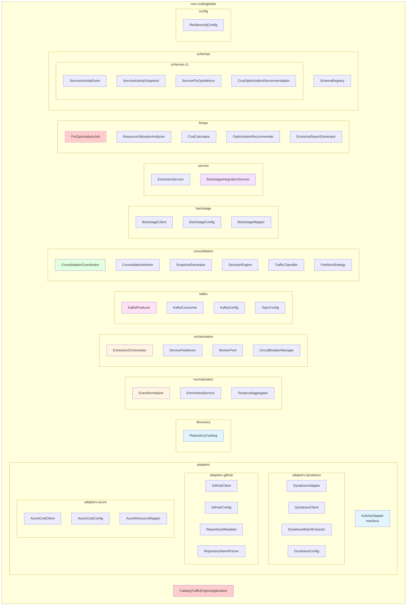
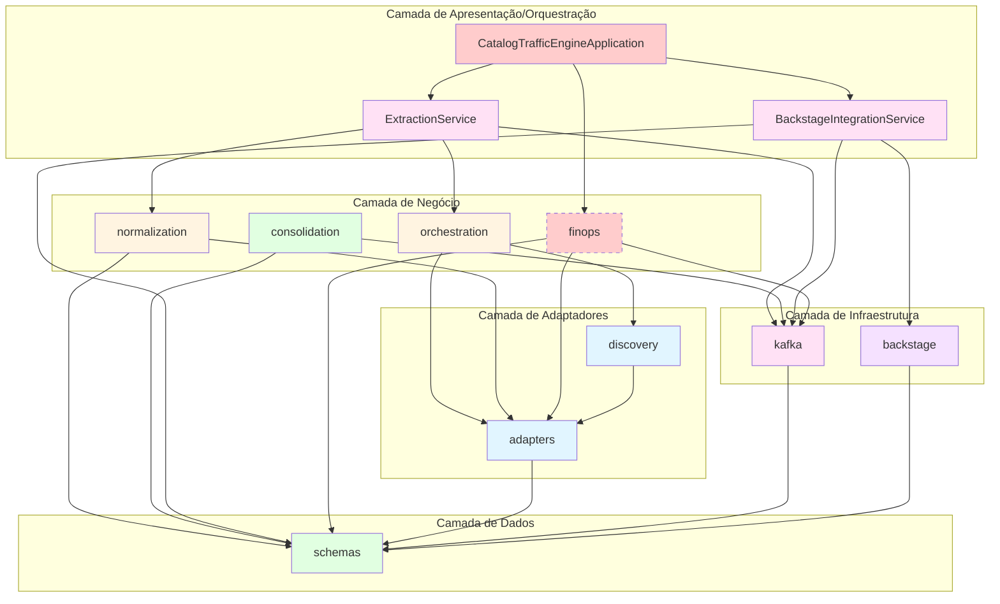
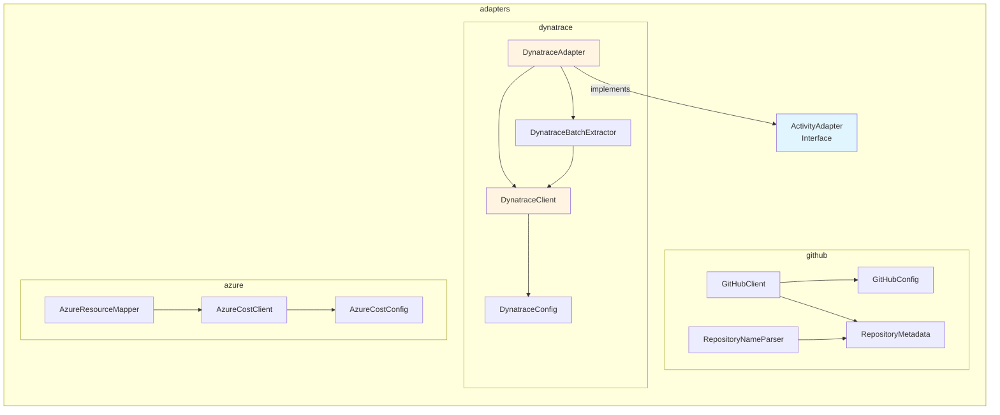
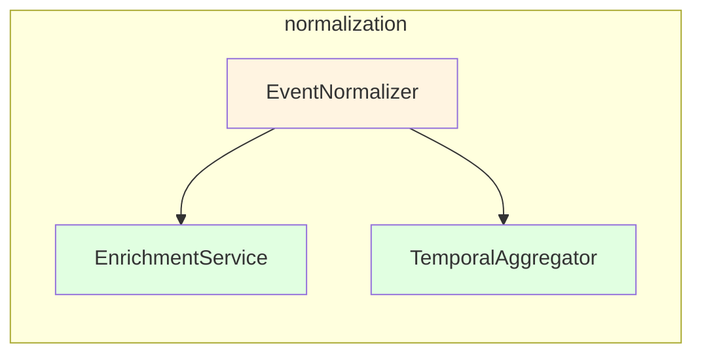
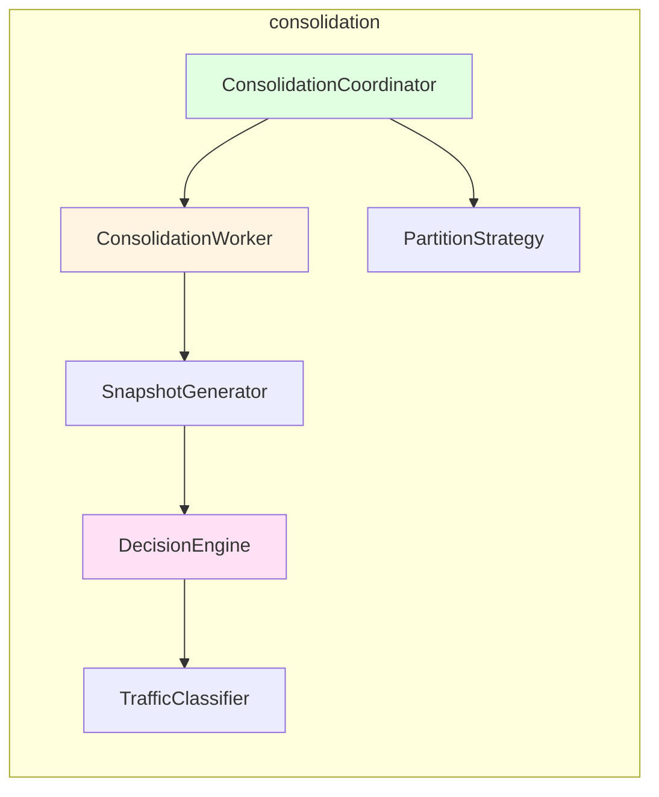
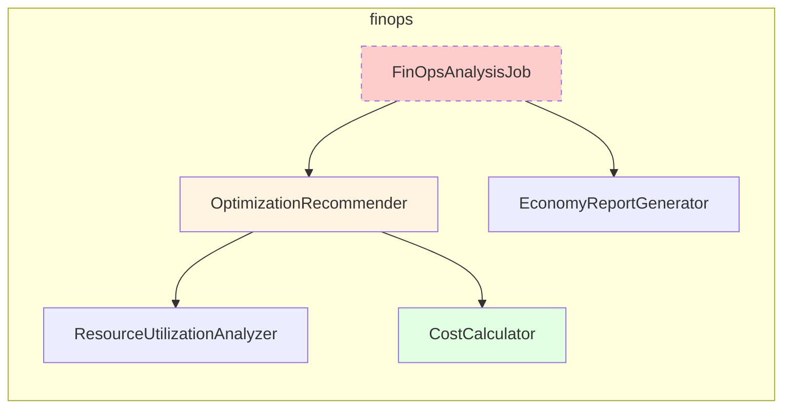
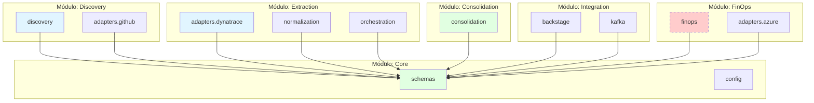

# Diagramas de Pacote - Catalog Traffic Engine

Este documento apresenta a estrutura de pacotes do sistema e suas dependências.

---

## 1. Estrutura de Pacotes Principal



---

## 2. Dependências entre Pacotes



---

## 3. Detalhamento por Camada

### 3.1 Camada de Adaptadores (adapters.*)



### 3.2 Camada de Normalização (normalization.*)



### 3.3 Camada de Consolidação (consolidation.*)



### 3.4 Camada FinOps (finops.*)



---

## 4. Princípios de Organização

### 4.1 Separação por Responsabilidade

- **adapters**: Tradução de dados de fontes externas
- **discovery**: Descoberta de serviços
- **normalization**: Normalização e enriquecimento
- **orchestration**: Orquestração de processos
- **consolidation**: Consolidação e decisão
- **finops**: Análise financeira (futuro)
- **kafka**: Infraestrutura de mensageria
- **backstage**: Integração com Backstage
- **schemas**: Schemas de dados versionados
- **service**: Serviços de alto nível

### 4.2 Dependências Permitidas

```
schemas (nenhuma dependência interna)
    ↑
adapters, discovery
    ↑
normalization, orchestration
    ↑
consolidation, finops
    ↑
kafka, backstage
    ↑
service
    ↑
CatalogTrafficEngineApplication
```

### 4.3 Regras de Dependência

1. **schemas**: Não depende de nenhum outro pacote interno
2. **adapters**: Depende apenas de schemas
3. **normalization**: Depende de adapters e schemas
4. **consolidation**: Depende de schemas e kafka
5. **service**: Pode depender de todos os outros pacotes
6. **finops**: Depende de adapters, schemas e kafka (isolado)

---

## 5. Mapeamento para Componentes de Deploy

```mermaid
graph TB
    subgraph "Deployment: adapter"
        ADAPTER_POD[DynatraceAdapter]
        BATCH_POD[DynatraceBatchExtractor]
        ORCH_POD[ExtractionOrchestrator]
        NORM_POD[EventNormalizer]
    end
    
    subgraph "Deployment: consolidation-coordinator"
        COORD_POD[ConsolidationCoordinator]
    end
    
    subgraph "Deployment: consolidation-worker"
        WORKER_POD[ConsolidationWorker]
        SNAP_POD[SnapshotGenerator]
        DEC_POD[DecisionEngine]
    end
    
    subgraph "Deployment: backstage-integration"
        BS_INT_POD[BackstageIntegrationService]
        BS_CLIENT_POD[BackstageClient]
    end
    
    subgraph "Deployment: finops (futuro)"
        FINOPS_POD[FinOpsAnalysisJob]
    end
    
    ADAPTER_POD --> ADAPTER_POD
    BATCH_POD --> ADAPTER_POD
    ORCH_POD --> ADAPTER_POD
    NORM_POD --> ADAPTER_POD
    
    COORD_POD --> COORD_POD
    
    WORKER_POD --> WORKER_POD
    SNAP_POD --> WORKER_POD
    DEC_POD --> WORKER_POD
    
    BS_INT_POD --> BS_INT_POD
    BS_CLIENT_POD --> BS_INT_POD
    
    FINOPS_POD -.->|Futuro| FINOPS_POD
    
    style ADAPTER_POD fill:#e1f5ff
    style COORD_POD fill:#e1ffe1
    style WORKER_POD fill:#e1ffe1
    style BS_INT_POD fill:#f5e1ff
    style FINOPS_POD fill:#ffcccc,stroke-dasharray: 5 5
```



---

## 6. Visão de Módulos (Futuro)

Para evoluir para uma arquitetura modular:



