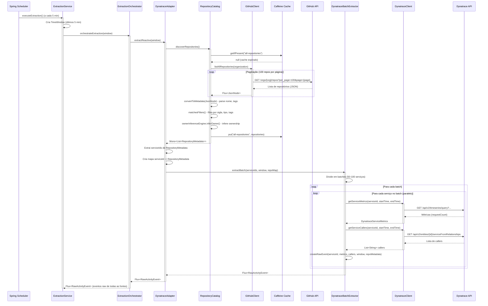
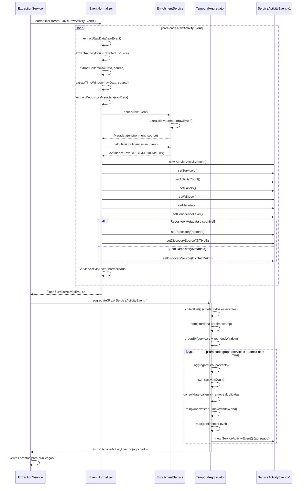
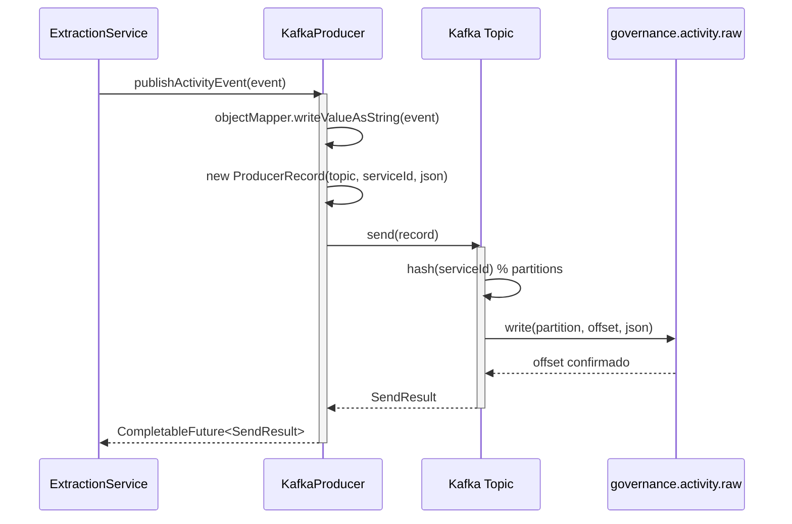
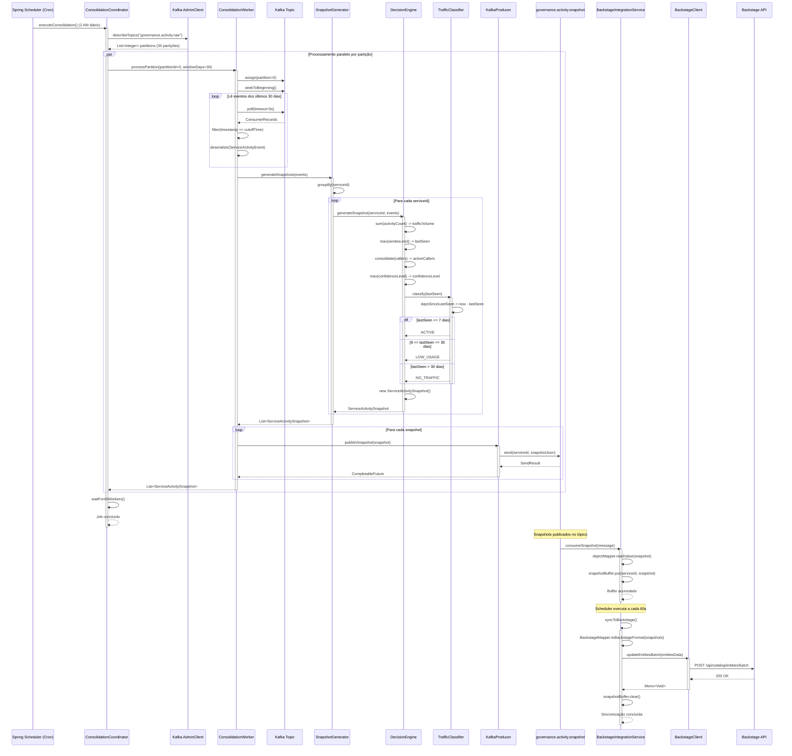

# Diagramas de Sequência - Catalog Traffic Engine

Este documento apresenta os diagramas de sequência para visualizar o fluxo de dados através das classes do sistema, dividido em três etapas principais: Extração, Transformação e Carga.

---

## 1. Etapa de Extração (Extract)

A etapa de extração é responsável por coletar dados de fontes externas (Dynatrace, Elastic, etc.) e convertê-los em eventos raw. A descoberta de serviços agora é feita via GitHub através do RepositoryCatalog.



**Notas importantes:**
- A descoberta de serviços é feita via GitHub (RepositoryCatalog), não mais via Dynatrace
- O cache de repositórios evita consultas repetidas à GitHub API (TTL configurável, padrão 240 minutos)
- RepositoryCatalog aplica filtros (sigla, tipo, tags) e infere ownership
- DynatraceAdapter recebe serviceIds do RepositoryCatalog e extrai métricas para esses serviços
- Processamento paralelo com múltiplos workers (configurável)
- Rate limiting e circuit breaker protegem contra sobrecarga das APIs

---

## 2. Etapa de Transformação (Transform)

A etapa de transformação normaliza eventos raw para o schema canônico e agrega temporalmente. Inclui informações de repositório e discovery source quando disponíveis.



**Notas importantes:**
- Normalização remove detalhes específicos de cada fonte
- EventNormalizer extrai RepositoryMetadata quando disponível (descoberta via GitHub)
- Discovery source é definido (GITHUB ou DYNATRACE) baseado na presença de RepositoryMetadata
- Enriquecimento adiciona metadados padronizados
- Agregação temporal reduz volume em ~90% (janelas de 5 minutos)
- Processamento determinístico através de ordenação

---

## 3. Etapa de Carga (Load) e Consolidação

A etapa de carga publica eventos no Kafka e executa consolidação diária para gerar snapshots.

### 3.1 Publicação Inicial (ExtractionService)



### 3.2 Consolidação Diária



**Notas importantes:**
- Consolidação processa 30 dias de eventos em paralelo (1 worker por partição)
- Classificação determinística baseada em regras de negócio
- Snapshots são publicados no Kafka para consumo assíncrono
- Backstage recebe atualizações em batch a cada 60 segundos

---

## Resumo do Fluxo Completo

```
1. EXTRAÇÃO (a cada 5 min)
   Scheduler → ExtractionService → ExtractionOrchestrator → 
   DynatraceAdapter → RepositoryCatalog → GitHubClient → GitHub API
   DynatraceAdapter → DynatraceBatchExtractor → DynatraceClient → Dynatrace API

2. TRANSFORMAÇÃO (streaming)
   EventNormalizer → EnrichmentService → TemporalAggregator
   (Inclui extração de RepositoryMetadata e definição de discoverySource)

3. CARGA INICIAL
   KafkaProducer → Kafka (governance.activity.raw)

4. CONSOLIDAÇÃO (diária às 2 AM)
   ConsolidationCoordinator → ConsolidationWorker (paralelo) → 
   SnapshotGenerator → DecisionEngine → TrafficClassifier → 
   KafkaProducer → Kafka (governance.activity.snapshot)

5. INTEGRAÇÃO BACKSTAGE (a cada 60s)
   BackstageIntegrationService → BackstageClient → Backstage API
```

---

## Pontos de Escalabilidade

- **Extração**: Processamento paralelo com 10-20 workers, rate limiting por worker
- **Transformação**: Streaming reativo, sem bloqueios
- **Carga**: Kafka particionado (30 partições), permite paralelismo horizontal
- **Consolidação**: 1 worker por partição (30 workers paralelos)
- **Backstage**: Batch updates reduzem carga na API

